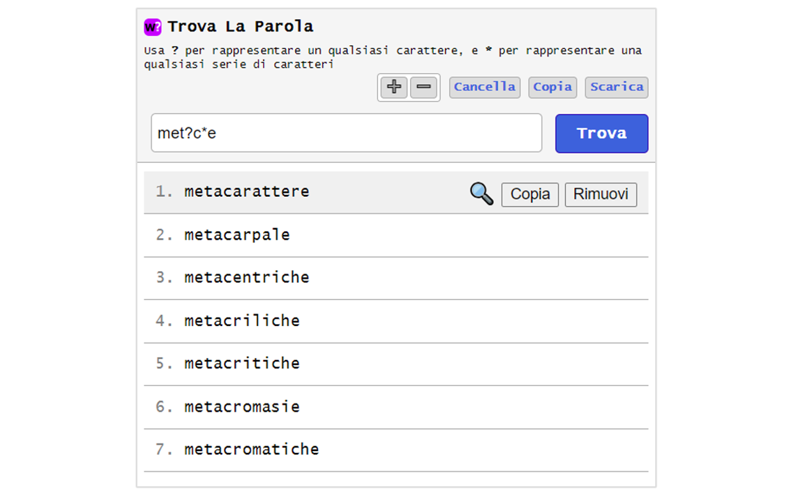

#  Chrome Extension - Trova La Parola

Estensione Chrome per trovare una parola italiana mediante wildcard (?,*)

## Caratteristiche

- Ricerca in un dizionario di circa **990.000** termini
- Ricerca mediante wildcard **(?,*)**
- **?** per rappresentare un qualsiasi carattere
- <b>*</b> per rappresentare una qualsiasi serie di caratteri
- Copia singolo risultato
- Rimozione dei risultati non voluti
- Copia di tutti i risultati
- Salvataggio di tutti i risultati in un file testuale
- Zoom del testo
- Ricerca dei risultati su Google

## Esempi di ricerca
Cercando **ar?a** si otterranno i seguenti risultati: 

- Ar**b**a
- Ar**c**a
- Ar**i**a
- Ar**m**a
- ...

Cercando **vo*are** si otterranno i seguenti risultati: 

- vo**cabolarizz**are
- vo**calizz**are
- vo**c**are
- vo**ci**are
- vo**cifer**are
- ...

# Links
- Home page: https://www.vincenzodevivo.com/
- GitHub: https://github.com/deltavi

# ☕ Offrimi un caffè
Mi vuoi offrire un caffè! Visita 
https://www.buymeacoffee.com/vincenzodevivo oppure https://www.paypal.com/paypalme/VincenzoDeVivoAutore

... oppure comprati un mio libro su Amazon 📚 https://www.amazon.it/Vincenzo-De-Vivo/e/B09MPTBBFY

## Screenshots

